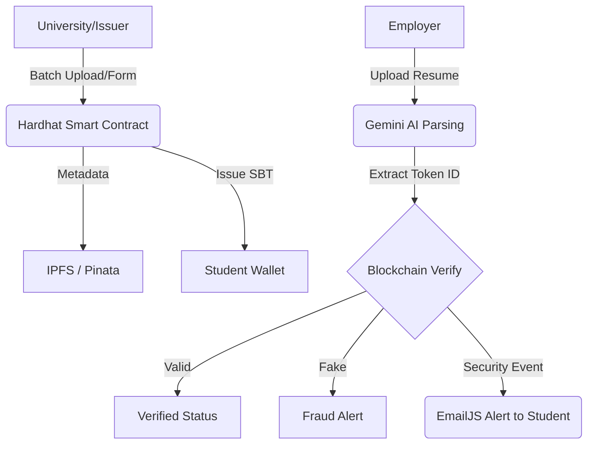

<div align="center">
  
  <h1>Nova Xi</h1>
  <p><b>Blockchain-Powered Academic Credential Verification System</b></p>
  
  [](https://opensource.org/licenses/MIT)
  [](https://reactjs.org/)
  [](https://soliditylang.org/)
  [](https://ipfs.tech/)
  [](https://hardhat.org/)
  [](https://ai.google.dev/)
</div>

---

## 🌟 Overview
**Nova Xi** is a next-generation "Trust Layer" for academic credentials. By leveraging **Soulbound Tokens (SBTs)** and **Decentralized Storage (IPFS)**, we eliminate educational fraud and make certificate verification instant, tamper-proof, and universally accessible.

### 🛑 The Problem
Traditional paper and digital certificates are easily forged, lost, or difficult to verify. Verification often requires weeks of communication between employers and universities.

### ✅ The Solution
- **Soulbound Tokens:** Non-transferable NFTs that represent a student's permanent achievements.
- **AI Verification:** Automated resume parsing to detect credentials and cross-reference them with the blockchain.
- **Immutable Proof:** Once issued, a credential cannot be altered, spoofed, or deleted by unauthorized parties.

---

## 📸 Project Visualization
<div align="center">
  
</div>
## 📸 Workflow
<div align="center">
  
</div>

## 🏗️ System Architecture


---

## 🔥 Key Features
- **🎓 Multi-Mode Issuance:** Issue credentials via direct form input or batch-upload CSV/Excel files.
- **🕵️ AI Resume Guardian:** Upload a PDF resume; the system extracts ID data and verifies it against the blockchain automatically.
- **📊 Real-time Monitoring:** A live terminal simulation showing exactly how data flows from IPFS to the Smart Contract.
- **🛡️ Self-Revocation:** Students can "burn" their own tokens if they need to update or remove a credential.
- **📧 Security Alerts:** Instant email notifications to students whenever their credentials are verified by an employer.

---

## 🛠️ Technology Stack
- **Frontend:** React.js, Vite, Tailwind CSS, Web3Modal
- **Blockchain:** Solidity, Hardhat, Ethers.js
- **Storage:** IPFS (Pinata)
- **AI/ML:** Google Gemini API (AI Resume Parsing)
- **Services:** EmailJS (Push Notifications)

---

## 🚀 Getting Started

### 1. Prerequisite Setup
- Create a `.env` file in the root based on `.env.example`.
- Ensure you have **Metamask** installed and configured for a local node.

### 2. Backend (Blockchain)
```bash
# Install dependencies
npm install

# Start the local Hardhat node
npm run node

# In a new terminal, deploy the smart contract
npm run deploy:local
```

### 3. Frontend (UI)
```bash
cd frontend
npm install

# Start the development server
npm run dev
```

---

## 👨‍💻 Author
**Atharv Bhavsar**
- [GitHub](https://github.com/atharvbhavsar)
- [LinkedIn](https://www.linkedin.com/in/atharv-bhavsar)

---
<div align="center">
  Built with ❤️ for a more trustworthy academic world.
</div>
